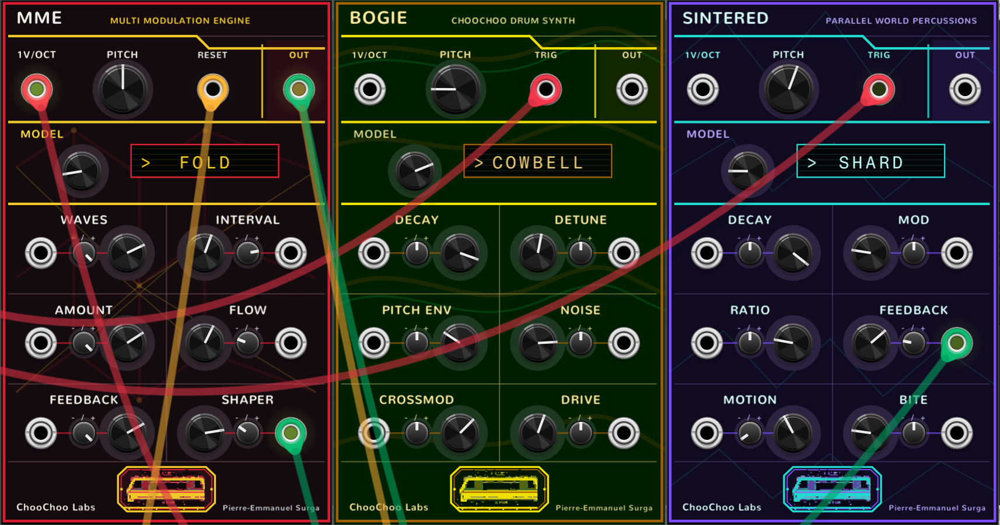

# Choo Choo Rack

Three VCV Rack 2 modules, ported from ChooChooTracker.



## Modules

### MME - Multi Modulation VCO engine

A mono two-oscillator VCO built around interactions between its internal
oscillators. Inspired by Noise Engineering and Mutable Warps.

Good for dirty gritty sounds, unstable modulations, techno, noise and industrial.

Parameters:
- Models: Ring, Fold, Cross, VPM, Sync, Logic or Vocode. Different types of modulations
- Intervals sets the oscillators relationship
- Waves selects paired oscillator shapes
- Amount set the strength of the oscillators interaction
- Flow changes the direction/variant of the interatction
- Feedback : from subtle to deliberately unruly
- Shaper : from clean through saturation to wavefolding

### Bogie - Drum Synth

A kit of engines that sound like digital drum machines. Inspired by the Machinedrum. General purpose synthetic drums.

- Kick: Pitch-swept sine body with a modulated harmonic and a short noise transient.
- Snare: Two pitched resonators blended with bright, filtered noise.
- Hat: Six inharmonic square oscillators with staggered decays and a noise layer.
- Clap: Filtered noise shaped into three rapid bursts, with an optional tonal click.
- Tom: Dual sine resonator with pitch sweep, FM overtones and a brief noise attack.
- Rim: Short triangle-and-sine resonator sharpened by a fast noise transient.
- FM: Sine carrier driven by decaying audio-rate frequency modulation.
- Noise: Variable blend of bright and dark filtered noise with a tonal trace.
- Cowbell: Two inharmonic square oscillators with cross-modulation and metallic detuning.
- Cymbal: Six detuned square partials with staggered envelopes and broadband noise.
- Shaker: Bright noise animated by low-frequency amplitude modulation and a pitched tick.
- Clave: High-ratio triangle and sine resonators shaped into a short wooden impulse.

The lower half of the parameter ranges targets conventional drum sounds, while higher settings open into more synthetic timbres.

### Sintered - Experimental Digital Percussion

The percussive version of MME. Weird percussions from another world, good for IDM, noise, industrial, techno and experimentation. Very wild timbre variations. 

- Knot: Three coupled sine oscillators tangled through phase modulation and wavefolding.
- Shard: Feedback-driven oscillator pair crushed through aggressive folding and saturation.
- Burst: Colored noise and a pitched resonator injected into a regenerative wavefolder.
- Comb: Oscillator-and-noise excitation fed into a short, unstable comb resonator.
- Logic: Quantized oscillators combined with XOR, AND, OR or comparator logic, then folded.
- Melt: Feedback-warped frequency modulation pushed through soft saturation and noisy instability.

## Install

Download the Windows x64 `.vcvplugin` releases and install them with Rack's
Library menu, or copy them to `Documents/Rack2/plugins-win-x64`, then restart
Rack.

## Build

All three plugins target Rack 2 and require the matching Rack SDK plus a MinGW64
toolchain on Windows.

```sh
# MME
cd ChooChooMME
make RACK_DIR=/path/to/Rack-SDK dist

# Bogie
cd ChooChooBogie
make RACK_DIR=/path/to/Rack-SDK dist

# Sintered
cd ChooChooSintered
make RACK_DIR=/path/to/Rack-SDK dist
```

The standalone DSP tests are `ChooChooMME/tests/mme_core_test.cpp`,
`ChooChooBogie/tests/bogie_core_test.cpp` and
`ChooChooSintered/tests/sintered_core_test.cpp`.

## License and attribution

MIT. Bogie and Sintered are original Choo Choo implementations. MME incorporates tracker
adaptations of MIT-licensed Mutable Instruments Warps techniques; retained
source notices apply.
